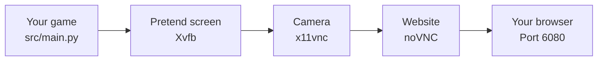
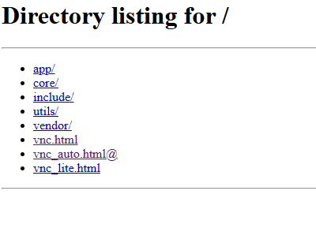

# How This Pygame Codespace Works (Beginner's Guide)

This guide explains, in plain language, how you can write a **Pygame** game and
actually _see it_ and _play it_ inside a Codespace — even though a Codespace is
just a computer in the cloud with **no screen**.

---

## The Big Idea

Normally, a game window needs a real screen, keyboard, and mouse. A Codespace
doesn't have any of those — it's a "headless" computer running on a server
somewhere.

So we use a clever trick: we **build a pretend screen**, **record what's on it**,
and **send that picture to your web browser**. To you, it looks and feels like a
normal game window, but it's actually streaming live to a browser tab.

Think of it like a **security camera**:

1. A pretend TV screen is set up inside the Codespace (you never see it directly).
2. A "camera" points at that screen and films it.
3. The video feed is streamed to a website.
4. You open that website in your browser and watch (and control) the game.

---

## The Pipeline (Step by Step)

Here is the journey your game takes, from code to your screen:



| Step | Tool                          | What it does (in plain English)                                         |
| ---- | ----------------------------- | ----------------------------------------------------------------------- |
| 1    | **Your game** (`src/main.py`) | The Pygame code you write. It wants to draw a window.                   |
| 2    | **Xvfb**                      | A fake/pretend screen that exists only in memory. Your game draws here. |
| 3    | **x11vnc**                    | A "camera" that watches the pretend screen and broadcasts the picture.  |
| 4    | **noVNC**                     | Turns that broadcast into a normal web page your browser can open.      |
| 5    | **Your browser**              | You open port `6080` and watch/play the game live.                      |

All of this is started for you automatically by a single script: `start.sh`.

---

## How to Use It

### 1. Open the Codespace

Open this project in a GitHub Codespace. The setup runs automatically the first
time, installing everything you need.

### 2. (First time only) Set up dependencies

If you ever need to install the Python packages manually, run:

```bash
python -m venv .venv          # create a virtual environment
source .venv/bin/activate     # turn it on
pip install -r requirements.txt   # install Pygame
```

### 3. Start the game

Run the start script. This launches the pretend screen, the camera, the website,
**and** your game — all in one command:

```bash
bash start.sh
```

### 4. Open the game in your browser

- Go to the **Ports** tab in VS Code (usually near the terminal).
- Find the port labelled **`6080` (noVNC Pygame Display)**.
- Click the globe / "Open in Browser" icon next to it.
- You will get to this screen:



- Open `vnc.html` and connect to your VNC.

You should now see your game running! 🎮

> Tip: Sometimes the browser opens automatically when the Codespace starts.

---

## Editing Your Game

1. Open `src/main.py`.
2. Change the code (for example, change `"red"` or `"purple"` to another colour).
3. Stop the running game in the terminal by pressing **`Ctrl + C`**.
4. Run `bash start.sh` again to see your changes.

---

## Common Problems

**I don't see anything in the browser.**

- Make sure you ran `bash start.sh` and it didn't show an error.
- In the noVNC page, make sure you clicked **Connect**.
- Try refreshing the browser tab.

**The keyboard doesn't control the game.**

- Click _inside_ the game area in the browser first, so it knows where your
  key presses should go.

**Port 6080 isn't in the Ports tab.**

- Run `bash start.sh` — the port only appears once the stack is running.

**It says a tool is missing (Xvfb, x11vnc, etc.).**

- Just run `bash start.sh` again. It checks for missing tools and installs them
  automatically.

---

## In One Sentence

> You write a normal Pygame program; the Codespace draws it onto a pretend
> screen, films that screen, and streams it to your browser on port `6080` so
> you can play it — no desktop required.
